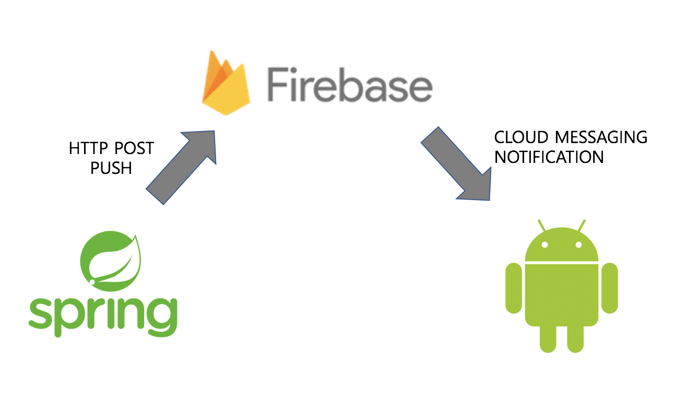

### fcm 푸시 기능 사용하기




사용자가 설정해놓은 설정 값을 기준으로 미세먼지 수치가 더 나빠졌을 경우 사용자에게 알림을 주는 기능을 구현하려고 한다. 이 기능을 만들기 위해서 서버에서 사용자의 스마트폰으로 푸시를 줄 수 있는 기능이 필요하다.

서버에서는 바로 안드로이드로 어떤 요청을 보낼 수는 없기 때문에 push 기능 구현을 위해 fcm을 사용하였다.

동작 원리는 위 이미지와 같이 스프링 서버에서 푸시에 사용할 데이터를 firebase 서버로 전송하고, firebase 서버에서 안드로이드 앱으로 푸시를 보내주는 방식으로 동작하게 된다.

실제 구현은 블로그의 소스가 있길래 그대로 사용하였다. 출처는 아래 밝혀놓았다. 이제 블로그에 나온 내용들을 정리하여 어떻게 사용하는지를 알아보자.

먼저 fcm 관련 컨트롤러 작성 전에 먼저 pom.xml에 fcm 관련 라이브러리들의 의존성을 주입해줘야한다.    

#### pom.xml에 추가

```xml
				<dependency>
            <groupId>com.googlecode.json-simple</groupId>
            <artifactId>json-simple</artifactId>
            <version>1.1.1</version>
        </dependency>
        
        <!-- https://mvnrepository.com/artifact/com.google.api-client/google-api-client -->
        <dependency>
            <groupId>com.google.api-client</groupId>
            <artifactId>google-api-client</artifactId>
            <version>1.26.0</version>
        </dependency>
                        
        <!-- https://mvnrepository.com/artifact/com.google.oauth-client/google-oauth-client -->
        <dependency>
            <groupId>com.google.oauth-client</groupId>
            <artifactId>google-oauth-client</artifactId>
            <version>1.26.0</version>
        </dependency>
                
        <!-- https://mvnrepository.com/artifact/com.google.http-client/google-http-client -->
        <dependency>
            <groupId>com.google.http-client</groupId>
            <artifactId>google-http-client</artifactId>
            <version>1.26.0</version>
        </dependency>
        
        <!-- https://mvnrepository.com/artifact/com.google.http-client/google-http-client-jackson2 -->
        <dependency>
            <groupId>com.google.http-client</groupId>
            <artifactId>google-http-client-jackson2</artifactId>
            <version>1.26.0</version>
        </dependency>  
        
        <!-- https://mvnrepository.com/artifact/com.google.guava/guava -->
        <dependency>
            <groupId>com.google.guava</groupId>
            <artifactId>guava</artifactId>
            <version>27.0.1-jre</version>
        </dependency>
 
```


#### 미리 준비해야할 것들

1. 비밀키 발급(fcm-***.json)
2. push 알림을 보낼 디바이스의 토큰 값 

  

#### 소스코드 분석

```java
public class PushService {
    @Value("${fcm.local.path}")
    String path;

    @Autowired
    UserDao userDao;

    private Logger log = LoggerFactory.getLogger(this.getClass());

    public void sendFcm(){
        List<UserToken> userTokenList = userDao.selectUserToken();

        for (UserToken token : userTokenList) {
            try {
                String MESSAGING_SCOPE = "https://www.googleapis.com/auth/firebase.messaging";
                String[] SCOPES = {MESSAGING_SCOPE};

                GoogleCredential googleCredential = GoogleCredential
                        .fromStream(new FileInputStream(path))
                        .createScoped(Arrays.asList(SCOPES));
                googleCredential.refreshToken();

                HttpHeaders headers = new HttpHeaders();
                headers.add("content-type", MediaType.APPLICATION_JSON_VALUE);
                headers.add("Authorization", "Bearer " + googleCredential.getAccessToken());

                JSONObject notification = new JSONObject();
                notification.put("body", "미세먼지 수치가 나쁩니다. 외출 시 마스크를 착용해주세요!");
                notification.put("title", "wannaGoOut");

                JSONObject message = new JSONObject();

                message.put("token", token.getUserToken());
                message.put("notification", notification);

                log.debug("token : {}", token);
                JSONObject jsonParams = new JSONObject();
                jsonParams.put("message", message);

                HttpEntity<JSONObject> httpEntity = new HttpEntity<JSONObject>(jsonParams, headers);
                RestTemplate rt = new RestTemplate();

                ResponseEntity<String> res = rt.exchange("https://fcm.googleapis.com/v1/projects/{프로젝트이름}/messages:send"
                        , HttpMethod.POST
                        , httpEntity
                        , String.class);

                if (res.getStatusCode() != HttpStatus.OK) {
                    log.debug("FCM-Exception");
                    log.debug(res.getStatusCode().toString());
                    log.debug(res.getHeaders().toString());
                    log.debug(res.getBody().toString());

                } else {
                    log.debug(res.getStatusCode().toString());
                    log.debug(res.getHeaders().toString());
                    log.debug(res.getBody().toLowerCase());

                }
            } catch (Exception e) {
                e.printStackTrace();
            }
        }
    }
}

```


##### \+ 더 알아볼 점 

로컬에서의 절대경로와 서버에서의 절대경로가 달라지게 되어 각각 다르게 작성한 후 수정하려고 한다.  더 좋은 방법이 있는지 찾아볼것


### Push service 쿼리 작성하기

push는 현재 측정한 데이터가 내가 설정해놓은 미세먼지 수치보다 농도가 심할 때 사용자에게 알려주는 방식으로 진행된다. 그렇기 때문에 측정한 데이터와 사용자 설정 데이터를 비교하는 작업이 필요하다. 나는 미세먼지 테이블과 사용자 테이블의 조인을 통해서 쿼리문을 작성하였다.

```sql
SELECT 
    u.id,
    usr_token,
    (6371 * ACOS(COS(RADIANS(u.usr_addr_x)) * COS(RADIANS(x_location_info)) * COS(RADIANS(y_location_info) - RADIANS(u.usr_addr_y)) + SIN(RADIANS(u.usr_addr_x)) * SIN(RADIANS(x_location_info)))) AS distance
FROM
    dustInfo d,
    userTable u
WHERE measure_time > (NOW() - INTERVAL 80 MINUTE) and usr_setting < dust
HAVING distance < 5
ORDER BY distance , measure_time DESC;
```

80분 이내에 데이터만을 사용하는 이유는 공공 데이터를 매시각 20분마다 받아오기때문에 db에 저장된 시간은 정각이더라도 그 다음 측정시간까지의 차이가 존재하기 때문에 80분으로 설정하였다.

간단히 위 쿼리를 설명하자면 80분 이내에 사용자와 5km 이내에 측정된 데이터 중에서 미세먼지 수치가 사용자 설정 수치보다 높을 경우 push 메세지를 통해서 알림을 주는 방식이다. 

##### 발생할 수 있는 문제

이 서비스를 20분에 한번씩 실행한다 했을 때, 미세먼지 수치가 개선된 이후에도 80분 이내라면 계속 push가 갈 수 있다는 것이다. 이 것을 해결할 수 있는 방법에 대해서 생각이 더 필요하다. -> 30분에 한번씩 수행하게 했기 때문에 30분으로 시간을 일단 수정함.

 


**소스코드 출처** : <https://web-inf.tistory.com/22>

